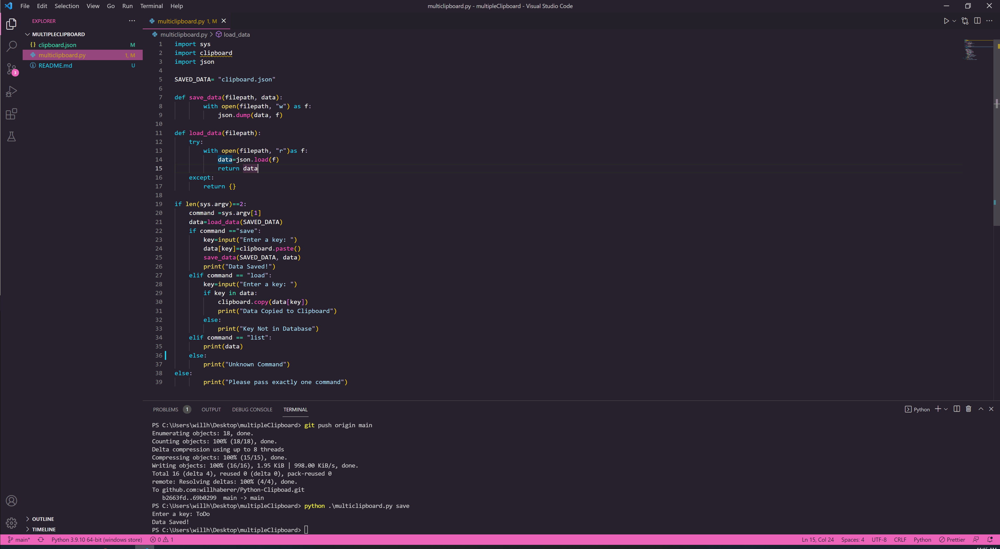

# MultiClipboard-CLI

-[Description](#description) -[Purpose](#purpose) -[Usage](#usage) -[Mock-up](#) -[Credits](#credits) -[License](#license)

## Description

This MultiClipboard Command Line Interface allows users to save and access data quikly to a users clipboard.

## Purpose

This MultiClipboard Command Line Interface was created to give users a CLI app to store and access multiple previosuly copied data as well as to practice and get introduced to python.

## Usage

1. Clone the Git repo to your loacl machine and run python multiclipboard.py to get started

## Mock-Up

## Credits

<a href="https://github.com/willhaberer" target="_blank">Will Haberer</a>

## License

MIT License

Copyright (c) [2022]
